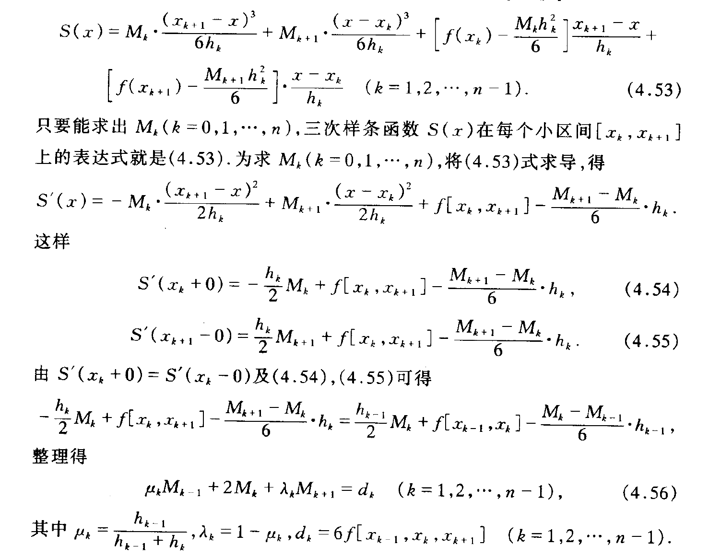
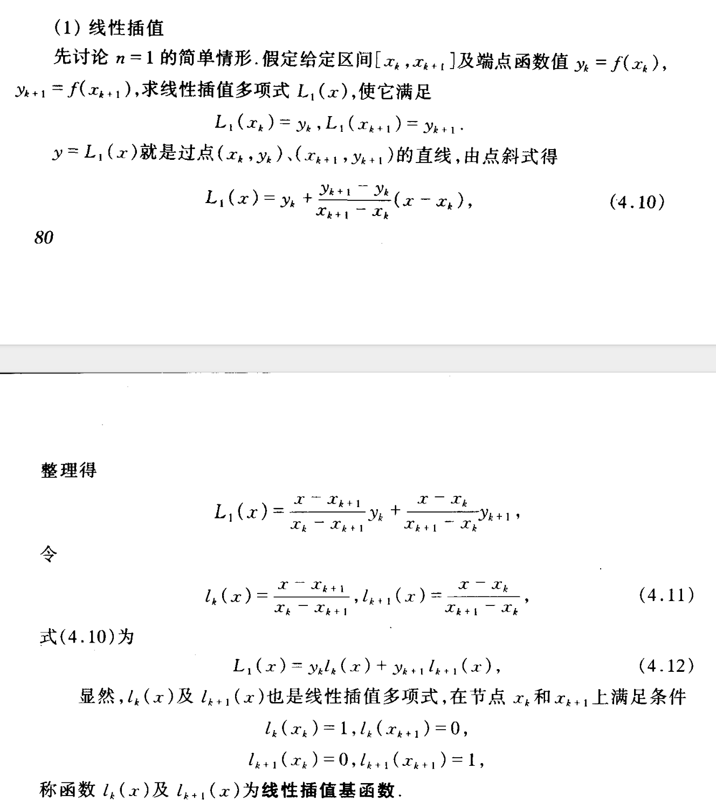

# Joints' Motion Controller——工程上层机构运动控制
| 技术方向 | 开源部分             | 开源技术点                                       | 编写负责人 |
| -------- | -------------------- | ------------------------------------------------ | ---------- |
| 电控方案 | 工程上层机构运动控制 | 便于单片机驱动和高效开发的一种机械臂轨迹控制方式 | 曾熙朗     |

## 背景

​		23赛季的工程机器人和以往不一样，这个赛季它具备机械臂的结构，并需要对机械臂进行良好的控制。传统的工程上层控制往往采用循环增量或直接下发目标的方式进行控制，但是对于机械臂而言，这种控制方式是危险而且难以调试的。因此，为了适应全新的需求，开发出了这套适合于单片机驱动且能够提高开发效率的轨迹点驱动器。

## 功能

​		使用轨迹点驱动器，可以直接通过定义关键轨迹点的方式，对机械臂的运动轨迹进行设计。它具备以下功能：

1. 自定义关节数量和轨迹点数量；
2. 自定义每一个轨迹点中，各关节的位置、速度和该轨迹点的执行时间，可以只定义位置不定义速度；
3. 自定义各关节的运动速度限制；
4. 自动根据关节速度限制检测不合理的轨迹点，并根据关节速度限制将整机运动减速，保证姿态不会变形，除速度发生变化外，其他运动仍会遵循设定的轨迹点运行；
5. 设计有终止函数，通过调用该函数可以及时终止轨迹执行；
6. 通过和FreeRTOS的任务阻塞时间配合，可以使轨迹点的执行时间和实际符合，也可不按真实时间执行，此时轨迹将按照执行器内部设定的最大速度执行。

## 依赖

- RTOS，或其他可以执行循环的环境即可。
- C库 math.h

## 文件架构

```
ArmMotionPlan.
│  readme.md
│
└─MotionController
        MotionController.cpp
        MotionController.h

```

## 使用方法

复制文件并引用头文件即可使用。

```c++
#include "MotionController.h"
```

- 使用前，在头文件中确定关节数量和最大轨迹点数量

```c++
#define MaxPointAmount 100    //轨迹点最大数量
#define JointAmount 7         //关节数量
```

- 创建`MotionControllerClassdef`对象，并在构造函数中传入目标指针、FreeRTOS任务执行的频率和真实时间跟随开关

```c++
MotionControllerClassdef motionController(ParamServer.JointTarget, 10, true);
```

- 调用`setJointSpeedLimit`函数设置关节速度限制

```c++
motionController.setJointSpeedLimit(&JointParam[0].max_speed,&JointParam[1].max_speed,&JointParam[2].max_speed,&JointParam[3].max_speed,&JointParam[4].max_speed,&JointParam[5].max_speed,&JointParam[6].max_speed);
```

- 调用`receiveTracjectory`函数接收轨迹点数据

```c++
float time[MaxPointAmount] = {0,1,2,3,4,5,6,7,8};
float position[JointAmount][MaxPointAmount] = {{0,5,5,5,5,5,8,8,8},
                          {0,0,10,10,10,30,20,30,30},
                          {0,0,0,0,0,0,0,0,0},
                          {0,0,0,0,0,0,0,0,0},
                          {0,0,0,0,0,0,0,0,0},
                          {0,0,0,0,0,0,0,0,0},
                          {0,0,0,0,0,0,0,0,0}
                          };
float velocity[JointAmount][MaxPointAmount] = {{0,0.4,0.9,1,1.2,1,0,0,0},
                          {0,0,0,0,0,0,0,0,0},
                          {0,0,0,0,0,0,0,0,0},
                          {0,0,0,0,0,0,0,0,0},
                          {0,0,0,0,0,0,0,0,0},
                          {0,0,0,0,0,0,0,0,0},
                          {0,0,0,0,0,0,0,0,0}
                          };
motionController.receiveTracjectory(9,time,position,velocity,true);
```

- 调用`interpolation`进行插值运算
- 以上的代码只需要在`jointControl`函数调用前调用一次
- 调用`jointControl`函数，该函数需要在任务中循环调用以实现增量控制

```c++
bool runstatus = motionController.jointControl();
```

- 在构造函数中可以设置是否跟随真实时间，跟随真实时间时，请设置目标函数执行的周期为**10ms**，轨迹点时间间隔不低于**0.1s**，此时轨迹点时间单位为秒。任一条件不满足将自动不跟随真实时间。
- 在执行过程中，可以通过`jointControl`函数的返回值读取轨迹点执行状态，在轨迹点执行过程中，可以调用`abort`函数终止轨迹执行。


## 原理与理论支持分析

​		执行器可以分为2部分：轨迹曲线拟合过程和曲线采样过程。

​		对于提供的轨迹点信息，曲线拟合过程使用了2种拟合方法，以适配不同的轨迹信息。一种是能充分利用位置和速度信息的三次样条插值方法，从数值分析等教材中可以得到以下公式和理论推导：



将上述公式转换成代码，便可以得到拟合的曲线公式。

​		另一种为一次拉格朗日插值，当只提供轨迹点的位置信息时，使用一次拉格朗日插值的方法比使用三次样条插值更简单也更安全，能充分避免三次样条插值在点与点之间产生的“震荡”。一次拉格朗日插值的公式如下：



将上述公式转换为代码，便可以得到拟合的曲线。

​		对于拟合后的曲线，以时间作为自变量，时间不断向后推进，读取自变量对应的因变量，即可得到当前时刻某关节对应的位置目标。


## 未来优化方向

- 考虑引入力矩控制
- 优化机械臂超速的解决方法
